# Even Realities Studio

[](https://github.com/gabrielevierti/er-studio)
[](https://github.com/gabrielevierti/er-studio)
[](LICENCE)

Editor, file explorer, live glasses display, simulator control, console, terminal, metrics and packaging — all in one window.

## Why this exists

The official Even Hub toolchain is solid — web SDK, desktop simulator, packaging CLI — but the workflow it produces is fragmented. You write code in your editor, run Vite in a terminal, launch the simulator in its own window, and read logs somewhere else. Four surfaces for one task, re-orchestrated by hand on every run cycle.

I wanted what Android developers have had for a decade: open one application, write code, press RUN, see the device screen next to the editor. Nothing like that existed for the G2, so I built it.

ER Studio doesn't replace the official tooling; it orchestrates it. Under the hood it drives the real `evenhub-simulator`, the real Vite dev server and the real `evenhub-cli` — you just never touch them directly.

**How the mirror works.** The simulator is a native LVGL window and can't be embedded. But since v0.7.0 it ships an HTTP automation control plane: launched with `--automation-port`, it exposes the framebuffer as a PNG, the app's console buffer, and TouchBar input injection over plain HTTP. ER Studio runs it as a hidden child process and rebuilds the experience on top of that API — so the pixels are the simulator's pixels, the input is real input, and the logs are your app's real logs. Nothing is emulated or faked.

## Features

### Text Editor


A full Monaco-based code editor for writing your G2 applications without leaving ER Studio. TypeScript, JavaScript, HTML, CSS, JSON and other project files are all handled directly inside the IDE.

### Workspace

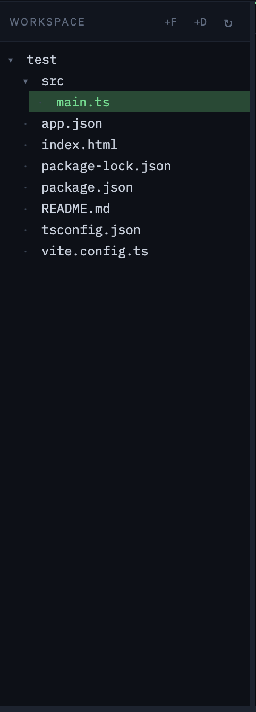

Browse and manage your entire project workspace directly inside ER Studio. The file tree automatically updates when files are created or changed.

### Live G2 Simulator

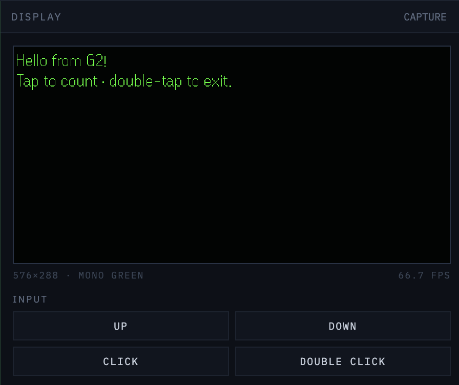

Run your application and see the G2 simulator directly inside the IDE. The display comes from the official Even Realities simulator, with integrated controls for interacting with the glasses.

### Web View

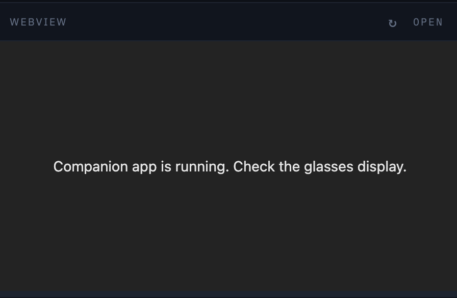

Preview your application's web interface without opening another browser window. Develop the glasses experience and its web interface side-by-side.

### Terminal

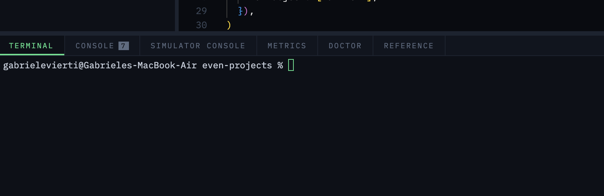

A built-in terminal for running commands, installing dependencies and interacting with your project without leaving ER Studio.

### Console

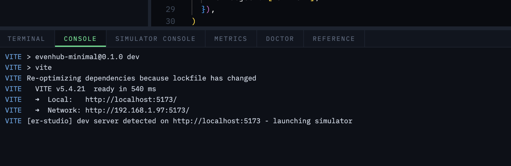

View development-server output, process logs and application messages directly inside the IDE.

### Simulator Console

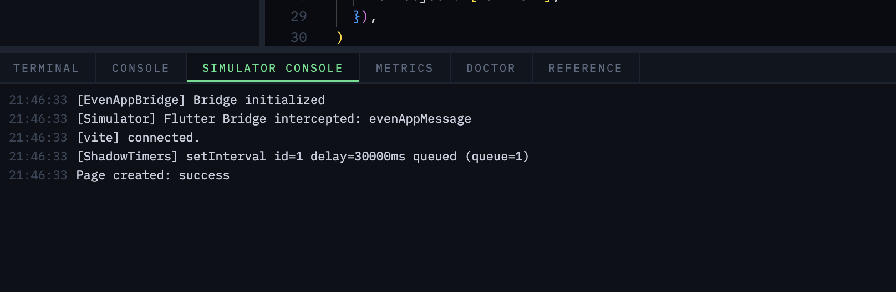

See the simulator's application console alongside your code and live display, making it easier to identify errors and understand what your application is doing.

### Metrics

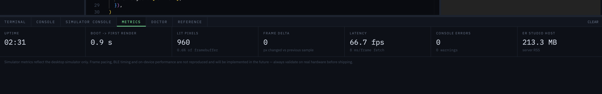

Monitor the current simulator session and development environment while testing your application.

### Environment Doctor

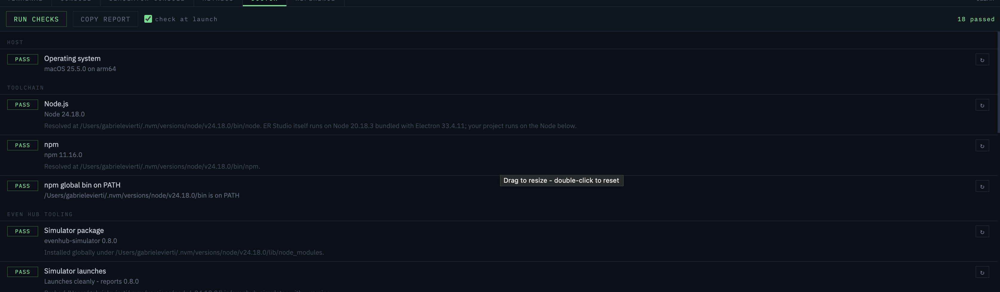

A diagnostics panel that checks your local development environment and tells you exactly what is missing or misconfigured.

It checks Node.js, npm, the Even Realities tooling, simulator, CLI, PATH, ports, project configuration and more.

Every problem comes with an actionable explanation of what is wrong and how to fix it.

### SDK Reference


A searchable reference for the Even Realities SDK, available directly inside the IDE so you don't have to constantly switch between your editor and the documentation.

Look up functions, classes, constants, parameters, return values and other API information while writing your application.

### Run, Stop & Pack


The entire development cycle is controlled from the main toolbar.

**NEW** creates a project from an official Even Realities template.

**RUN** starts the development server and launches the simulator.

**STOP** stops the current development session.

**PACK** builds your application with the official Even Realities CLI and produces the `.ehpk` package.

**Create → Write → Run → Test → Debug → Package.**

**Text Editor**
For all in one dev and wiriting your apps code
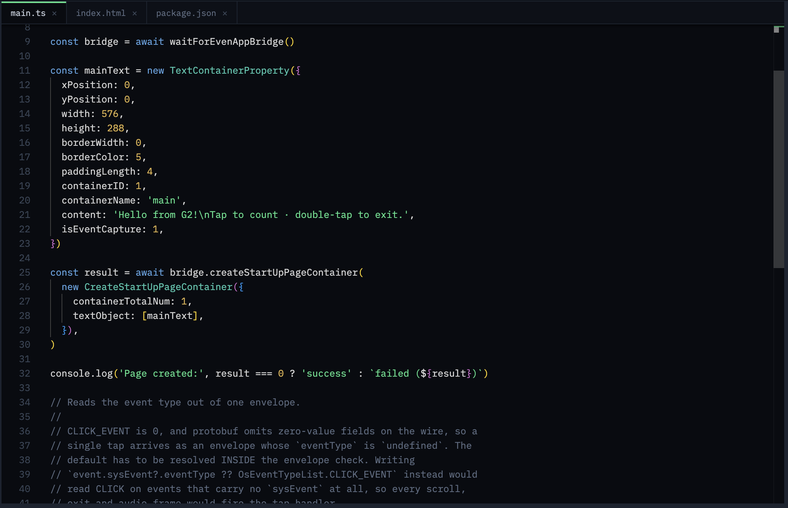

**Simulator**


**WebView**


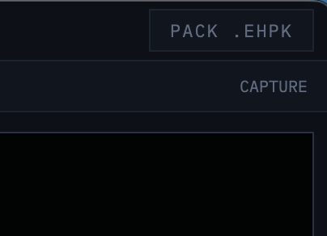


**Easy Runnning**


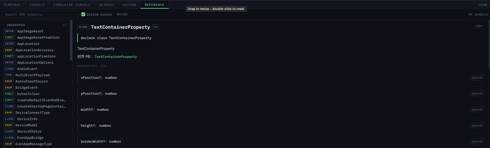


## Getting started

Requires macOS and Node 18+ (Even's docs ask for 20 LTS or 22+). Ideally install the Even Hub tooling globally — otherwise ER Studio falls back to `npx`, which is slower:

```
npm i -g @evenrealities/evenhub-simulator @evenrealities/evenhub-cli
```

The application lives in the `er-studio/` subfolder of the repository, so there are two `cd` steps:

```
git clone https://github.com/gabrielevierti/er-studio.git
cd er-studio/er-studio
npm install

npm run app     # desktop app
npm start       # or: browser mode at http://127.0.0.1:4477
npm run dist    # build the installable .app / .dmg into dist/
```

Point ER Studio at your projects folder with `~/.er-studio.json`:

```json
{
  "workspace": "/Users/you/dev/even-projects",
  "hideSimulator": true
}
```

Then: **NEW** → pick a template → **RUN** → watch the lens come alive.

On first launch macOS asks permission to control System Events (that's the window-hiding mechanism), and since the build is unsigned the packaged app needs right-click → Open the first time. If anything doesn't work, the **DOCTOR** panel will tell you why.

## Contributing

Please feel free to reach out, open issues, make pull requests, try the software out, add support for more platforms or quite literally anything else — it's always nice working with others! :)

If you're reporting a problem, open **DOCTOR** and press **COPY REPORT** — that one paste carries your OS, Node version, tooling versions and everything that's misconfigured.

## Disclaimer

ER Studio is an independent community project, built out of pure passion — I don't do this for a living. It is not affiliated with, endorsed by, or supported by Even Realities; it orchestrates their publicly published npm packages and documented APIs. All trademarks belong to their respective owners.

For full transparency: I do **not** currently own a pair of Even G2s — everything here was built against the official simulator and public documentation.

## License

[MIT](LICENCE) © 2026 Gabriele Vierti