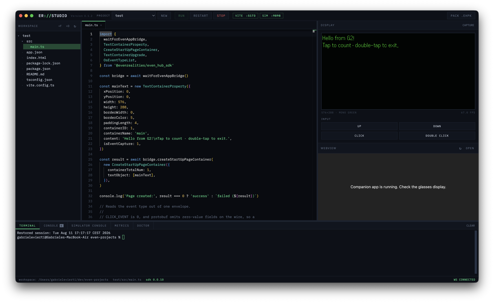

# Even Realities Studio

[](https://github.com/gabrielevierti/er-studio)
[](https://github.com/gabrielevierti/er-studio)
[](LICENCE)



Editor, file explorer, live glasses display, simulator control, console, terminal, metrics and packaging — all in one window.

## Why this exists

The official Even Hub toolchain is solid — web SDK, desktop simulator, packaging CLI — but the workflow it produces is fragmented. You write code in your editor, run Vite in a terminal, launch the simulator in its own window, and read logs somewhere else. Four surfaces for one task, re-orchestrated by hand on every run cycle.

I wanted what Android developers have had for a decade: open one application, write code, press RUN, see the device screen next to the editor. Nothing like that existed for the G2, so I built it.

ER Studio doesn't replace the official tooling; it orchestrates it. Under the hood it drives the real `evenhub-simulator`, the real Vite dev server and the real `evenhub-cli` — you just never touch them directly.

**How the mirror works.** The simulator is a native LVGL window and can't be embedded. But since v0.7.0 it ships an HTTP automation control plane: launched with `--automation-port`, it exposes the framebuffer as a PNG, the app's console buffer, and TouchBar input injection over plain HTTP. ER Studio runs it as a hidden child process and rebuilds the experience on top of that API — so the pixels are the simulator's pixels, the input is real input, and the logs are your app's real logs. Nothing is emulated or faked.

## What it does

**Project lifecycle** — scaffold from the official `evenhub-templates` (degit clone and `npm install` handled for you); one-click **RUN** starts Vite, detects its port from stdout and launches the simulator against it; **PACK** builds and produces the `.ehpk` ready for the developer portal.

**Writing code** — Monaco (the engine inside VS Code), fully vendored so it works offline. TS/JS IntelliSense plus highlighting for HTML, CSS/SCSS, JSON, Markdown, YAML, XML and shell. File explorer backed by a filesystem watcher, so the tree updates itself when scaffolds finish or anything changes externally. Draggable splitters; sizes persist across sessions.

**Running and debugging** — live 576×288 glasses mirror with pixel-perfect PNG capture, TouchBar input pad, embedded phone webview, and a five-panel dock: terminal, unified process log, simulator console with error badges, metrics, and the doctor.

**Environment doctor** — checks the whole local setup and says what's wrong in plain language: Node and npm versions, whether the npm global bin is actually on the PATH ER Studio inherited, simulator and CLI versions, port 9898, config validity, and the selected project down to `app.json` against the documented `evenhub pack` schema. Every failure comes with the exact command or doc link that fixes it, and **COPY REPORT** gives you a paste-ready summary for Discord or a bug report.

**Desktop app** — a native macOS application (Electron shell embedding the local server) that recaptures focus when the simulator steals it, then hides the simulator window entirely. Also runs in plain browser mode.

## Architecture

```
ER Studio window (Electron / browser)
        │  REST + WebSocket
ER Studio server (Node, 127.0.0.1 only)
        ├── /api/fs      workspace file system (path-traversal hardened)
        ├── /api/run     session control
        │                  ├─ spawns: npm run dev  (project's Vite)
        │                  └─ spawns: evenhub-simulator <url> --automation-port 9898
        ├── /api/sim     proxy → simulator control plane
        │                  ├─ GET  /screenshot   framebuffer PNG → live mirror
        │                  ├─ GET  /console      app logs (incremental since_id)
        │                  └─ POST /input        TouchBar gestures
        ├── /api/doctor  environment diagnostics
        └── /ws          status events, process logs, terminal
```

Everything speaks to official packages. ER Studio adds no custom protocol layer between your app and the platform — what runs in here is exactly what will run when you sideload or submit.

The stack is deliberately lean: a plain Node server (Express + ws), a vanilla JS frontend with no framework and no build step, and an Electron shell. Monaco and xterm.js are the only heavyweight dependencies, both vendored.

Small tool, but built like it expects to be poked at: the server binds to 127.0.0.1 only, every client-supplied path is verified to stay inside the workspace root, simulator input and scaffold parameters are validated against strict allowlists, and a crash in any single handler is caught rather than taking the studio down.

## Getting started

Requires macOS and Node 18+ (Even's docs ask for 20 LTS or 22+). Ideally install the Even Hub tooling globally — otherwise ER Studio falls back to `npx`, which is slower:

```
npm i -g @evenrealities/evenhub-simulator @evenrealities/evenhub-cli
```

The application lives in the `er-studio/` subfolder of the repository, so there are two `cd` steps:

```
git clone https://github.com/gabrielevierti/er-studio.git
cd er-studio/er-studio
npm install

npm run app     # desktop app
npm start       # or: browser mode at http://127.0.0.1:4477
npm run dist    # build the installable .app / .dmg into dist/
```

Point ER Studio at your projects folder with `~/.er-studio.json`:

```json
{
  "workspace": "/Users/you/dev/even-projects",
  "hideSimulator": true
}
```

Then: **NEW** → pick a template → **RUN** → watch the lens come alive.

On first launch macOS asks permission to control System Events (that's the window-hiding mechanism), and since the build is unsigned the packaged app needs right-click → Open the first time. If anything doesn't work, the **DOCTOR** panel will tell you why.

## Honest limits

- The simulator is **not a hardware emulator** — frame pacing, BLE timing and on-device performance aren't reproduced, and the metrics panel describes the simulator session, not the glasses. I can't close that gap yet, since I don't own a pair.
- The mirror's frame rate is bounded by how fast the simulator serves screenshots.
- The interactive pty terminal depends on `node-pty` building on your machine; when it can't, ER Studio degrades to a line-based command runner automatically.
- macOS only for now. The server core is platform-neutral — window hiding and focus recapture are the macOS-specific parts, and help with Windows and Linux is very welcome.

## Roadmap

- Automated pre-submission QA panel: headless checks against the App Submission guidelines, built on the same automation API
- QR sideload helper for on-device testing
- Frame-diff visualization on the mirror
- BLE-level metrics and, eventually, direct PC-to-glasses development
- G1 support, if a sensible path through the community tooling emerges

## Contributing

Please feel free to reach out, open issues, make pull requests, try the software out, add support for more platforms or quite literally anything else — it's always nice working with others! :)

If you're reporting a problem, open **DOCTOR** and press **COPY REPORT** — that one paste carries your OS, Node version, tooling versions and everything that's misconfigured.

## Disclaimer

ER Studio is an independent community project, built out of pure passion — I don't do this for a living. It is not affiliated with, endorsed by, or supported by Even Realities; it orchestrates their publicly published npm packages and documented APIs. All trademarks belong to their respective owners.

For full transparency: I do **not** currently own a pair of Even G2s — everything here was built against the official simulator and public documentation.

## License

[MIT](LICENCE) © 2026 Gabriele Vierti