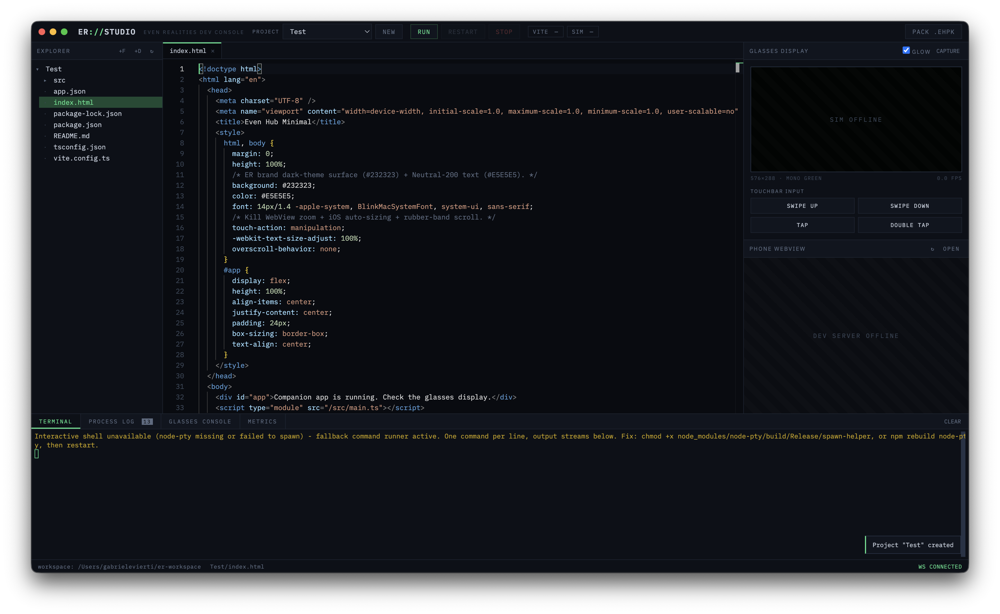

# ER Studio

**An integrated development environment for Even Realities G2 smart glasses.**

Editor, file explorer, live glasses display, simulator control, console, terminal, metrics and packaging — one window, tailored end-to-end for Even Hub development.



## Why this exists

The official Even Hub toolchain is solid: a web-based SDK, a desktop simulator, a CLI for packaging. But the workflow it produces is fragmented. You write code in your editor, run Vite in a terminal, launch the simulator in its own window, read app logs somewhere else, and keep a browser tab open on the side. Four surfaces for one task, constant window juggling, and every RUN cycle means re-orchestrating all of them by hand.

I wanted what Android developers have had for a decade: open one application, write code, press RUN, and see the device screen right next to the editor. Nothing like that existed for the G2 — so I built it.

ER Studio is that missing piece. It doesn't replace the official tooling; it orchestrates it. Under the hood it drives the real `evenhub-simulator`, the real Vite dev server, and the real `evenhub-cli` — you just never have to touch them directly.

## The key insight

The simulator can't be embedded — it's a native LVGL window. But since v0.7.0 it ships an **HTTP automation control plane**: launch it with `--automation-port` and it exposes the glasses framebuffer as a PNG, the app's console buffer, and TouchBar input injection over plain HTTP.

ER Studio runs the simulator as a hidden, managed child process and rebuilds the entire experience on top of that API:

- the **glasses display** in the app is a live mirror of the real framebuffer, polled continuously
- the **TouchBar pad** injects real `up / down / click / double_click` events
- the **glasses console** streams the app's `console.*` output, uncaught exceptions and failed fetches
- **metrics** are computed from the same data — lit pixels, frame deltas, boot-to-first-render

The simulator window itself gets hidden the moment it appears. You develop against its mirror, inside ER Studio, and never look at it again.

## What it does

**Project lifecycle**
- Scaffold new projects from the official `evenhub-templates` (minimal, asr, image, text-heavy) — degit clone and `npm install` handled for you
- One-click **RUN**: starts the Vite dev server, detects its port from stdout, launches the simulator against it. **STOP** kills both process groups cleanly, **RESTART** recycles the session
- One-click **PACK**: runs the production build and `evenhub-cli pack app.json dist`, producing the `.ehpk` ready for the developer portal

**Writing code**

- Monaco editor (the engine inside VS Code), fully vendored — no CDN, works offline
- TypeScript and JavaScript IntelliSense, plus highlighting and completion for HTML, CSS/SCSS, JSON, Markdown, YAML, XML and shell
- Auto-indentation, bracket pairing and colorization, format on paste, Cmd+S to save, dirty-state tabs, auto-save on RUN
- File explorer with create, rename, delete and move via context menu — backed by a filesystem watcher, so the tree updates itself when scaffolds finish, terminal commands touch files, or anything changes externally

**Running and debugging**

- Live 576×288 glasses display mirror with optional glow, pixel-perfect capture to PNG
- TouchBar input pad: swipe up, swipe down, tap, double tap
- Embedded phone webview — the plugin's web layer rendered directly beside the glasses
- Four-panel dock: integrated **terminal**, unified **process log** (Vite, simulator and jobs, color-coded), the **glasses console** with error badges, and a **metrics** panel — session uptime, boot-to-first-render time, lit pixel count, frame delta, mirror throughput, console error rate

**Desktop app**
- Ships as a native macOS application (Electron shell embedding the local server)
- Recaptures focus when the simulator launch steals it, then hides the simulator window entirely
- Also runs in plain browser mode (`npm start`) if you prefer

## Architecture

```
ER Studio window (Electron / browser)
        │  REST + WebSocket
ER Studio server (Node, 127.0.0.1 only)
        ├── /api/fs     workspace file system (path-traversal hardened)
        ├── /api/run    session control
        │                 ├─ spawns: npm run dev            (project's Vite)
        │                 └─ spawns: evenhub-simulator <url> --automation-port 9898
        ├── /api/sim    proxy → simulator control plane
        │                 ├─ GET  /screenshot   framebuffer PNG → live mirror
        │                 ├─ GET  /console      app logs (incremental since_id)
        │                 └─ POST /input        TouchBar gestures
        └── /ws         status events, process logs, terminal
```

Everything speaks to official packages: `@evenrealities/evenhub-simulator`, `@evenrealities/evenhub-cli`, `evenhub-templates`. ER Studio adds no custom protocol layer between your app and the platform — what runs in here is exactly what will run when you sideload or submit.

## Getting started

Requirements: macOS, Node.js ≥ 18, and ideally the Even Hub tooling installed globally (`npm i -g @evenrealities/evenhub-simulator @evenrealities/evenhub-cli` — otherwise ER Studio resolves them via npx on first run, which is slower).

```bash
git clone https://github.com/gabrielevierti/er-studio.git
cd er-studio
npm install

npm run app     # desktop app
npm start       # or: browser mode at http://127.0.0.1:4477
npm run dist    # build the installable .app / .dmg into dist/
```

Point ER Studio at your projects folder with `~/.er-studio.json`:

```json
{
  "workspace": "/Users/you/dev/even-projects",
  "hideSimulator": true
}
```

Then: **NEW** → pick a template → **RUN** → watch the lens come alive.

On first simulator launch, macOS will ask permission for ER Studio to control System Events — that's the window-hiding mechanism. The build is unsigned, so the packaged app needs right-click → Open the first time.

## Honest limits

- The simulator is **not a hardware emulator** — frame pacing, BLE timing and on-device performance are not reproduced, and the metrics panel describes the simulator session, not the glasses themselves - this needs to be fixed, but i can't test it since i have no real glasses at the moment.
- The mirror's frame rate is limited by how fast the simulator serves screenshots - would be nice to cap it to the actual speed of the glasses.
- The interactive pty terminal depends on `node-pty` building on your machine; when it can't, ER Studio degrades to a line-based command runner automatically.
- macOS only for now. The server core is platform-neutral; window hiding and focus recapture are the macOS-specific parts, so help is very much welcome when it comes to windows, linux or anything else

## Roadmap

- Automated pre-submission QA panel: headless checks against the App Submission guidelines (framebuffer renders at boot, exit dialog on double-tap, clean console) built on the same automation API
- QR sideload helper for on-device testing
- Frame-diff visualization on the mirror
- G1 support, if a sensible path through the community tooling emerges

## Disclaimer

ER Studio is an independent community project, created by me, who doesn't do this for a living out of pure passion.
It is not affiliated with, endorsed by, or supported by Even Realities. 
It orchestrates their publicly published npm packages and documented APIs. 

All trademarks belong to their respective owners.

I would also like to state that at this current point in time i do NOT own a pair of even g2s.

## Plans for the future

- Ideally it would be cool to add some more metrics, relative to the BLE connection, completely eliminating the need for the phone to be there, at least in the development stage - this would allow for over the air development while wearing the glasses and working on the apps.
- The ui is mature enough but it definitely needs some polish;

## Contributing

Please feel free to reach out, help, make pull requests, try the software out, add support for more things or quite literally anything else, it's always nice working with others! :) 

## License

MIT License

Copyright (c) 2026 Gabriele Vierti

Permission is hereby granted, free of charge, to any person obtaining a copy
of this software and associated documentation files (the "Software"), to deal
in the Software without restriction, including without limitation the rights
to use, copy, modify, merge, publish, distribute, sublicense, and/or sell
copies of the Software, and to permit persons to whom the Software is
furnished to do so, subject to the following conditions:

The above copyright notice and this permission notice shall be included in all
copies or substantial portions of the Software.

THE SOFTWARE IS PROVIDED "AS IS", WITHOUT WARRANTY OF ANY KIND, EXPRESS OR
IMPLIED, INCLUDING BUT NOT LIMITED TO THE WARRANTIES OF MERCHANTABILITY,
FITNESS FOR A PARTICULAR PURPOSE AND NONINFRINGEMENT. IN NO EVENT SHALL THE
AUTHORS OR COPYRIGHT HOLDERS BE LIABLE FOR ANY CLAIM, DAMAGES OR OTHER
LIABILITY, WHETHER IN AN ACTION OF CONTRACT, TORT OR OTHERWISE, ARISING FROM,
OUT OF OR IN CONNECTION WITH THE SOFTWARE OR THE USE OR OTHER DEALINGS IN THE
SOFTWARE.