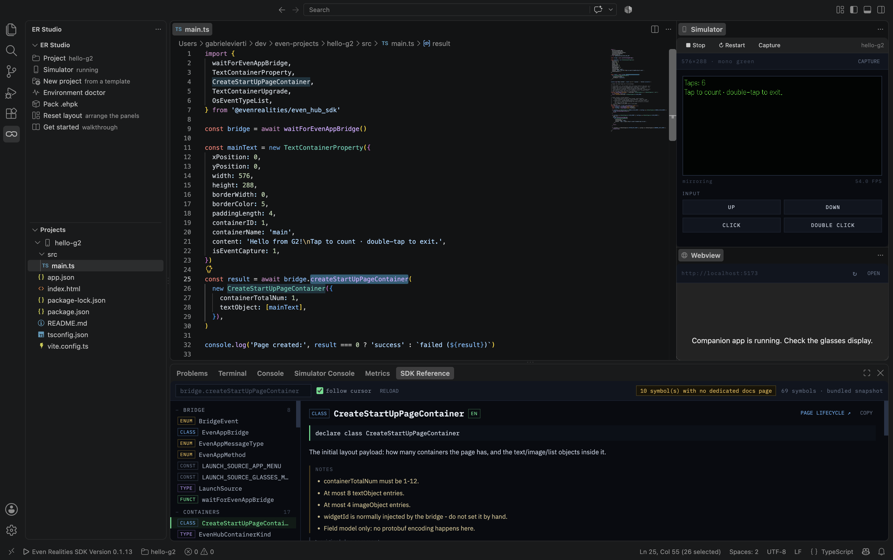

# ER Studio

**A VS Code extension for building Even Realities G2 apps.** Simulator, environment doctor and SDK reference, beside your code.



## Why this exists

The official Even Hub toolchain is solid — web SDK, desktop simulator, packaging CLI — but the workflow it produces is fragmented. You write code in your editor, run Vite in a terminal, launch the simulator in its own window, and read logs somewhere else. Four surfaces for one task, re-orchestrated by hand on every run cycle.

I wanted what Android developers have had for a decade: write code, press Run, see the device screen next to the editor. Nothing like that existed for the G2, so I built it.

ER Studio doesn't replace the official tooling; it orchestrates it. Under the hood it drives the real `evenhub-simulator`, the real Vite dev server and the real `evenhub-cli` — you just never touch them directly.

**How the mirror works.** The simulator is a native LVGL window and can't be embedded. But since v0.7.0 it ships an HTTP automation control plane: launched with `--automation-port`, it exposes the framebuffer as a PNG, the app's console buffer, and TouchBar input injection over plain HTTP. ER Studio runs it as a hidden child process and rebuilds the experience on top of that API — so the pixels are the simulator's pixels, the input is real input, and the logs are your app's real logs. Nothing is emulated or faked.

## Install

Node 18+ (Even's docs ask for 20 LTS or 22+) and the Even Hub tooling — Doctor will offer to install what's missing:

```bash
npm i -g @evenrealities/evenhub-simulator @evenrealities/evenhub-cli
```

Then build the extension:

```bash
git clone https://github.com/gabrielevierti/er-studio
cd er-studio
npm install
npm run package        # -> apps/vscode/er-studio-0.1.5.vsix
```

Extensions sidebar → `…` → **Install from VSIX**. Or open `apps/vscode` in VS Code and press **F5** to run it from source.

## What you get

Click the glasses icon. ER Studio asks where your projects should live, offers to create one if that folder is empty, and lays the workspace out:

| | |
| --- | --- |
| **Left** | ER Studio — controls, and your projects tree below them |
| **Right** | Simulator and Webview as editor tabs; Run, Stop, Restart and Capture on the simulator's own toolbar |
| **Bottom** | Console · Simulator Console · SDK Reference · Doctor, each its own tab |
| **Status bar** | Even Realities SDK version, run state, active project |

The SDK reference follows your cursor — put the caret on a symbol in a `.ts` or `.js` file and it jumps to that entry.

The editor, file tree and terminal are VS Code's own. Reimplementing them would have made the product worse.

## Architecture

```
packages/core     server, panel UI, doctor, SDK reference   <- all the logic
apps/vscode       the extension                             <- host surfaces only
```

The extension reimplements nothing. Each panel is framed from `/embed?panel=<id>` — the same page the core server serves, minus the editor chrome — so a fix to a panel reaches every surface at once and they cannot drift apart.

`npm start` serves that same UI at `http://127.0.0.1:4477` in a browser, which is what `ER Studio: Open Full UI in Browser` opens. That's also where the editor and terminal panels still live, for anyone who wants them.

See [CONTRIBUTING.md](CONTRIBUTING.md) for the development loop and [ARCHITECTURE.md](ARCHITECTURE.md) for the details.

## Tests

```bash
npm test
```

Runs the real server and the real extension against a stand-in for the `vscode` module. Nothing below the extension layer is mocked.

## History

Through v0.1.4 ER Studio was a standalone Electron application. The VS Code extension replaced it: marketplace distribution beats an unsigned dmg, and VS Code already provides the editor, file tree, terminal and window management the Electron shell had to build by hand. The desktop app remains in the git history.

MIT. Built by [Gabriele Vierti](https://github.com/gabrielevierti). Not an official Even Realities product.
